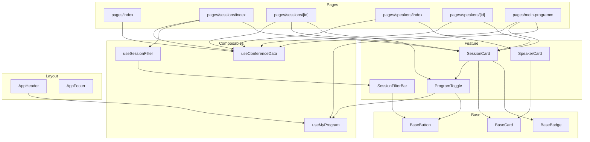

# B — ADR: Komponenten- & Ordnerstruktur

> Federführung: Person 2 · Status: **Entwurf** (Cross-Review ausständig) · Datum: 2026-10-06

## Kontext

FrontRow braucht drei Seitentypen (Übersichten mit Filter, Detailseiten, personalisiertes Dashboard), einen geteilten schreibgeschützten Datensatz und einen kleinen persönlichen State. Die Struktur muss über vier Sprints (Rendering-Strategien, PWA, AI-Protokoll) tragen und für zwei Personen mit parallelem Arbeiten übersichtlich bleiben. Setup ist Nuxt 4 (siehe [ADR D](./04-technologie-adr.md)), dessen Konventionen (`pages/`, `layouts/`, `composables/`, Auto-Imports) die Struktur teilweise vorgeben.

## Optionen

### Ordnerstruktur

**Option 1 — Technische Schichten (gewählt)**
`components/base`, `components/features/<domäne>`, `components/layout`, dazu `composables/`, `pages/`, `layouts/`, `types/`.
+ Entspricht der geforderten Schichtung Base/UI → Feature → Layout; passt zu Nuxt-Konventionen; Base-Komponenten sind sofort als domänenfrei erkennbar.
− Bei starkem Wachstum liegen Composable und Komponente eines Features in verschiedenen Ordnern.

**Option 2 — Feature-Slices**
`features/sessions/{components,composables,pages}`, `features/speakers/…`, `shared/ui`.
+ Alles zu einem Feature an einem Ort; skaliert bei vielen Teams.
− Kollidiert mit Nuxt-Auto-Import-Konventionen (`pages/`, `composables/` müssen konfiguriert werden); für 3 Domänen und 2 Personen Overhead ohne Nutzen.

**Option 3 — Flache Struktur (ursprünglicher Teamvorschlag: `components/{layouts,basics,views}`, `router/`)**
− `router/` und `views/` sind Vue-Router-Konzepte, die in Nuxt durch `pages/` ersetzt werden; `components/layouts` kollidiert mit Nuxts `layouts/`; eine Feature-Schicht fehlt → verworfen, weil das Grundgerüst der Dokumentation widersprechen würde.

### Headless-Aufteilung für die zentrale Interaktion „Session-Filterung"

**Option A — Logik als Composable `useSessionFilter()`, Darstellung in `SessionFilterBar.vue` (gewählt)**
+ Filterzustand und Ableitung sind reine Daten (kein DOM) → ohne Mounting testbar.
+ Dieselbe Logik dient der Programmübersicht und „Mein Programm" (z. B. nach Tag filtern).
+ Die Darstellung ist austauschbar: Selects am Desktop, Chips/Bottom-Sheet am Handy — ohne die Logik anzufassen. URL-Synchronisation (Query-Params) lässt sich später im Composable ergänzen, ohne UI-Änderung.

**Option B — Filterlogik direkt in der Seitenkomponente**
+ Weniger Dateien.
− Logik und Markup verwachsen; jede zweite Verwendung kopiert Code; Tests brauchen DOM.

**Gegenprobe (bewusst nicht headless): „Zum Programm hinzufügen"**
Die Logik ist ein `toggle(id)` auf dem geteilten `useMyProgram()`-State. `ProgramToggle.vue` ruft es direkt auf. Ein eigenes Headless-Composable hätte hier keinen Nutzen — es gäbe nichts zu abstrahieren. Headless wird dort eingesetzt, wo echte Wiederverwendung oder Austauschbarkeit entsteht, nicht als Selbstzweck.

## Entscheidung

Option 1 (technische Schichten) + Option A (Filter headless).

```
app/
├── assets/css/main.css        Tailwind-Einstieg
├── components/
│   ├── base/                  Base/UI-Layer: domänenfrei (BaseCard; ab Schritt 2 BaseBadge, BaseButton)
│   ├── features/              (ab Schritt 2) session/: SessionCard, SessionFilterBar · speaker/: SpeakerCard · program/: ProgramToggle
│   └── layout/                AppHeader, AppFooter
├── composables/               useConferenceData (Schritt 1) · ab Schritt 2: useSessionFilter, useMyProgram
├── layouts/default.vue
├── pages/                     index (Schritt 1) · ab Schritt 2: sessions/, sessions/[id], speakers/, speakers/[id], mein-programm
└── types/conference.ts
public/data/conference-data.json
docs/schritt1/
```

**Schicht-Regeln:**
- **Base** kennt keine Domäne, keinen State, nur Props/Slots.
- **Feature** kennt die Domäne, erhält aufgelöste Daten per Props (SessionCard bekommt Track/Room/Speaker fertig) oder nutzt Composables (ProgramToggle), komponiert Base-Komponenten.
- **Layout** rahmt Seiten (Header/Footer), kennt Navigation und globalen Zähler.
- **Pages** orchestrieren: `await useConferenceData()`, Filter-Composable, Übergabe an Features. Kein Markup-Detail.
- **Composables** sind zweischichtig: `useConferenceData` (Datenschicht: laden, indizieren, joinen) und darauf aufbauende Domänen-Composables (`useSessionFilter`, `useMyProgram`, ab Schritt 2 `useSessions`/`useSpeakers`). Nur die Datenschicht ruft `useAsyncData` auf. Details in [Konzept C](./03-state-management-konzept.md).
- Komponenten werden **ohne Pfad-Präfix** registriert (`pathPrefix: false`) → Dateinamen müssen projektweit eindeutig sein.

## Komponentenübersicht

In Schritt 1 existieren `pages/index`, Layout, `BaseCard` und `useConferenceData`. Alle anderen Knoten sind geplant und zur Einordnung bereits eingezeichnet; sie entstehen mit den Seiten in Schritt 2.



## Konsequenzen

- (+) Gradable Konsistenz: das Grundgerüst entspricht 1:1 dieser Struktur.
- (+) Base-Komponenten sind Kandidaten für eine spätere Komponentenbibliothek; Feature-Komponenten bleiben dünn.
- (+) Filterlogik ist ohne Browser testbar (Vitest, später).
- (−) Eindeutige Dateinamen sind Pflicht (Konvention: Präfix `Base*`, `App*`, Domäne im Namen).
- (−) Wächst das Projekt auf viele Domänen, wäre ein Umzug auf Feature-Slices (Option 2) ein mechanischer Refactor: die Schichtregeln bleiben gleich.
