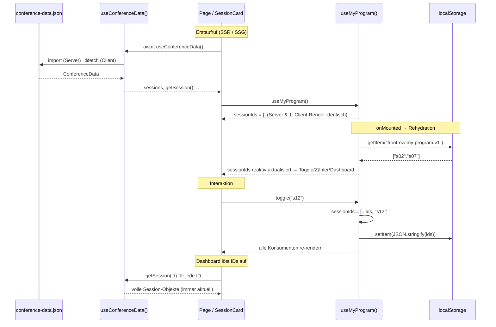

# C — State-Management-Konzept: „Mein Programm" & conference-data.json

> Federführung: Person 2 · Status: **Entwurf** (Cross-Review ausständig)

## Zwei Arten von State

FrontRow hat genau zwei State-Quellen mit gegensätzlichen Eigenschaften:

| | Geteilter Datensatz | „Mein Programm" |
|---|---|---|
| Quelle | `conference-data.json` (schreibgeschützt) | Nutzer:in |
| Lebensdauer | identisch für alle, ändert sich nur durch neues Deployment | pro Gerät, dauerhaft |
| Größe | 20 Sessions, 18 Speaker | einige IDs |
| Rendering | darf serverseitig/statisch gerendert werden | nur im Browser bekannt |

Deshalb werden sie getrennt modelliert, in zwei Composables, ohne zusätzliche Library.

## Geteilter Datensatz: `useConferenceData()`

**Laden.** Ein `useAsyncData('conference-data', …)` mit festem Key. Nuxt dedupliziert damit parallele Aufrufe aus mehreren Komponenten, überträgt das Ergebnis im Payload vom Server zum Client (kein zweiter Fetch nach der Hydration) und cached es bei Client-Navigation. Serverseitig/beim Prerendern wird die Datei direkt importiert, clientseitig per HTTP aus `/public/data/` geladen — derselbe Pfad, den später der Service Worker cachen kann. Die Quelle ist an genau einer Stelle austauschbar (GitHub-Raw-URL, Nitro-Route für die ISR-Simulation in Schritt 2).

**Modellieren.** Das Composable gibt die vier Listen als `computed` zurück sowie `Map`-Indizes für O(1)-Lookups (`getSession(id)`, `getSpeaker(id)`, …) und die Joins `speakersForSession()` / `sessionsForSpeaker()`. Komponenten bekommen aufgelöste Objekte per Props; niemand joint im Template.

**Verworfene Alternative:** je ein Composable pro Entität (`useSpeaker`, `useRoom`, `useTrack`, `useSession`). Die Daten kommen aus einer Datei; vier Composables hieße entweder vierfach laden oder verstecktes Modul-State teilen, und die Join-Logik (Session → Speaker → Sessions) wäre zerrissen. Bei vier Entitäten mit Querverweisen ist ein Daten-Composable mit Lookups die einfachere und ehrlichere Lösung.

## Persönlicher State: `useMyProgram()`

**Datenstruktur: nur IDs** (`string[]`), nicht volle Session-Objekte. Begründung: Eine einzige Quelle der Wahrheit — ändert sich im Datensatz ein Raum oder eine Uhrzeit (genau das Szenario von Schritt 2), zeigt „Mein Programm" automatisch den aktuellen Stand statt einer veralteten Kopie. Kein Schema-Migrationsproblem, wenn sich `Session` erweitert. Winziger Storage-Footprint. Der Preis: Der Datensatz muss geladen sein, bevor das Programm angezeigt werden kann — er ist ohnehin auf jeder Seite geladen und wird in Schritt 3 offline gecached. Gelöschte IDs werden beim Auflösen still gefiltert.

**Reaktive Verteilung: `useState`.** Nuxts `useState('my-program')` ist pro Key app-weit geteilt und SSR-sicher. Header-Zähler, `ProgramToggle` in jeder Karte und das Dashboard lesen dieselbe Referenz. Pinia wäre eine legitime Alternative, für ein einzelnes Array mit vier Mutationen aber eine zusätzliche Abhängigkeit ohne Mehrwert. Reines Modul-`ref` (wie in Hausübung 2) wäre unter SSR ein Shared-State-Leck zwischen Requests.

**Persistenz.** Key `frontrow:my-program:v1` (Versionssuffix für spätere Migrationen). Schreiben passiert explizit in den Mutationen `add/remove/toggle/clear`, nicht über einen Watcher, der am Scope einer Komponente hängen und mit ihr verschwinden würde. Fehler (Quota, Private Mode) schlagen still fehl; der State bleibt im Speicher.

**Rehydration.** Erst in `onMounted`, einmalig (Flag `isHydrated`). Damit sind Server-HTML und erster Client-Render identisch (kein Hydration-Mismatch); unmittelbar danach erscheinen die gespeicherten Sessions. Bis dahin ist der Toggle deaktiviert und das Dashboard zeigt einen Ladehinweis. Dass dieser Teil clientabhängig ist, ist die Vorlage für die Rendering-Entscheidung „Mein Programm = CSR" in Schritt 2.

## Datenfluss

## Konsequenzen

- (+) Eine Datenquelle, keine Kopien; Programmänderungen schlagen überall durch.
- (+) Kein Store-Framework, zwei kleine Composables, alles typisiert.
- (−) Kurzes Aufblitzen des leeren Zustands vor der Rehydration (wird in Schritt 2 durch CSR/`<ClientOnly>` für das Dashboard adressiert).
- (−) Keine Synchronisation zwischen Tabs (per `storage`-Event ergänzbar, aktuell nicht gefordert).
