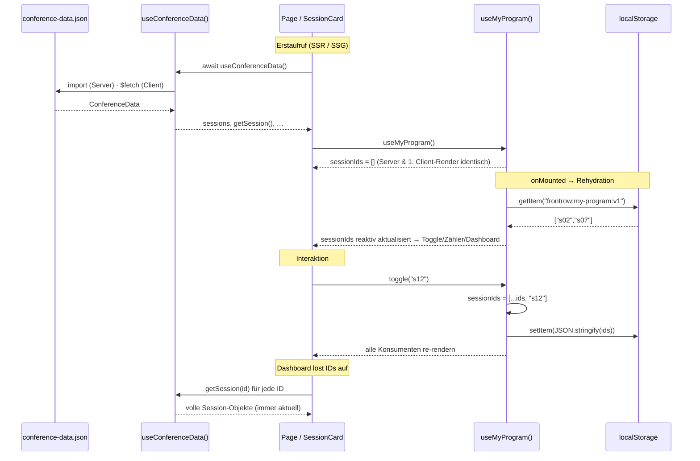

# C — State-Management-Konzept: „Mein Programm" & conference-data.json

> Federführung: Person 2 · Status: **Entwurf** (Cross-Review ausständig)
> Umsetzungsstand: `useConferenceData()` ist in Schritt 1 implementiert; `useMyProgram()` und die Domänen-Composables sind hier als Konzept beschrieben und folgen mit den Seiten in Schritt 2.

## Zwei Arten von State

Zwei State-Quellen mit gegensätzlichen Eigenschaften:

| | Geteilter Datensatz | „Mein Programm" |
|---|---|---|
| Quelle | `conference-data.json` (schreibgeschützt) | Nutzer:in |
| Lebensdauer | identisch für alle, ändert sich nur durch neues Deployment | pro Gerät, dauerhaft |
| Größe | 20 Sessions, 18 Speaker | einige IDs |
| Rendering | darf serverseitig/statisch gerendert werden | nur im Browser bekannt |

Sie werden getrennt modelliert, in zwei Composables, ohne zusätzliche Library.

## Geteilter Datensatz: `useConferenceData()`

**Laden.** Ein `useAsyncData('conference-data', …)` mit festem Key: Nuxt dedupliziert parallele Aufrufe, überträgt das Ergebnis im Payload vom Server zum Client (kein zweiter Fetch) und cached es bei Client-Navigation. Serverseitig wird die Datei importiert, clientseitig per HTTP aus `/public/data/` geladen — der Pfad, den später der Service Worker cachen kann. Die Quelle ist an einer Stelle austauschbar (GitHub-Raw-URL, Nitro-Route für Schritt 2). In `localStorage` wird der Datensatz bewusst nicht kopiert: Er ist für alle gleich, eine lokale Kopie veraltet, und Offline-Verfügbarkeit löst in Schritt 3 der Service Worker auf HTTP-Ebene.

**Modellieren.** Vier Listen als `computed`, `Map`-Indizes für O(1)-Lookups (`getSession(id)` …) und die Joins `speakersForSession()` / `sessionsForSpeaker()`. Komponenten bekommen aufgelöste Objekte per Props.

**Schichtung statt Composable pro Entität.** Ein Composable je Entität (`useSpeaker`, `useRoom` …), das jeweils selbst lädt, hieße vierfach laden oder verstecktes Teilen eines Keys, und die Joins wären zerrissen. Stattdessen zwei Ebenen:

- **Datenschicht** `useConferenceData()`: laden, indizieren, joinen. Kennt keine Sortierung, keine Zeitslots, keine Anzeige.
- **Domänenschicht** (`useSessions()`, `useSpeakers()`, ab Schritt 2): baut auf der Datenschicht auf und liefert, was die Domäne braucht, etwa Sessions nach Tag/Uhrzeit sortiert oder nach Zeitslot gruppiert. `useSessionFilter()` und `useMyProgram()` sind bereits solche Domänen-Composables.

Regel: Ein Domänen-Composable ruft nie selbst `useAsyncData` auf, sondern immer `useConferenceData()`. In Schritt 1 gibt es noch keine Domänenlogik; reine Durchreich-Composables wären Abstraktion als Selbstzweck und entstehen erst mit echtem Bedarf.

## Persönlicher State: `useMyProgram()`

**Datenstruktur: nur IDs** (`string[]`), nicht volle Session-Objekte. Ändert sich im Datensatz ein Raum oder eine Uhrzeit (das Szenario von Schritt 2), zeigt „Mein Programm" automatisch den aktuellen Stand statt einer veralteten Kopie. Kein Migrationsproblem bei Schema-Änderungen, winziger Storage-Footprint. Der Preis: Der Datensatz muss geladen sein — er ist auf jeder Seite geladen und wird in Schritt 3 offline gecached. Gelöschte IDs werden beim Auflösen still gefiltert.

**Reaktive Verteilung: `useState`.** Pro Key app-weit geteilt und SSR-sicher; Header-Zähler, Toggle und Dashboard lesen dieselbe Referenz. Pinia wäre legitim, für ein Array mit vier Mutationen aber eine Abhängigkeit ohne Mehrwert. Ein Modul-`ref` (wie in Hausübung 2) wäre unter SSR ein Shared-State-Leck zwischen Requests.

**Persistenz.** Key `frontrow:my-program:v1` (Versionssuffix für Migrationen). Geschrieben wird explizit in den Mutationen, nicht über einen Watcher, der am Scope einer Komponente hinge. Fehler (Quota, Private Mode) schlagen still fehl.

**Rehydration.** Erst in `onMounted`, einmalig (Flag `isHydrated`), damit Server-HTML und erster Client-Render identisch sind (kein Hydration-Mismatch). Bis dahin zeigt das Dashboard einen Ladehinweis. Dass dieser Teil clientabhängig ist, ist die Vorlage für „Mein Programm = CSR" in Schritt 2.

## Datenfluss

## Konsequenzen

- (+) Eine Datenquelle, keine Kopien; Programmänderungen schlagen überall durch.
- (+) Kein Store-Framework, zwei kleine Composables, alles typisiert.
- (−) Kurzes Aufblitzen des leeren Zustands vor der Rehydration (wird in Schritt 2 durch CSR/`<ClientOnly>` für das Dashboard adressiert).
- (−) Keine Synchronisation zwischen Tabs (per `storage`-Event ergänzbar).
